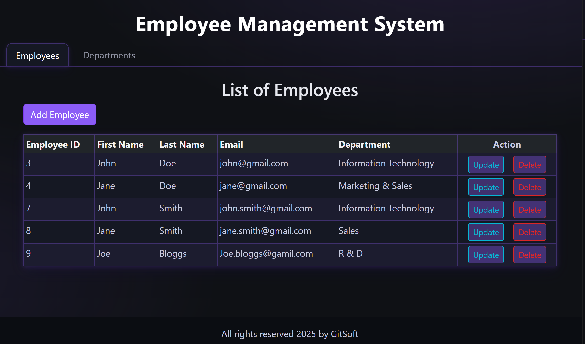
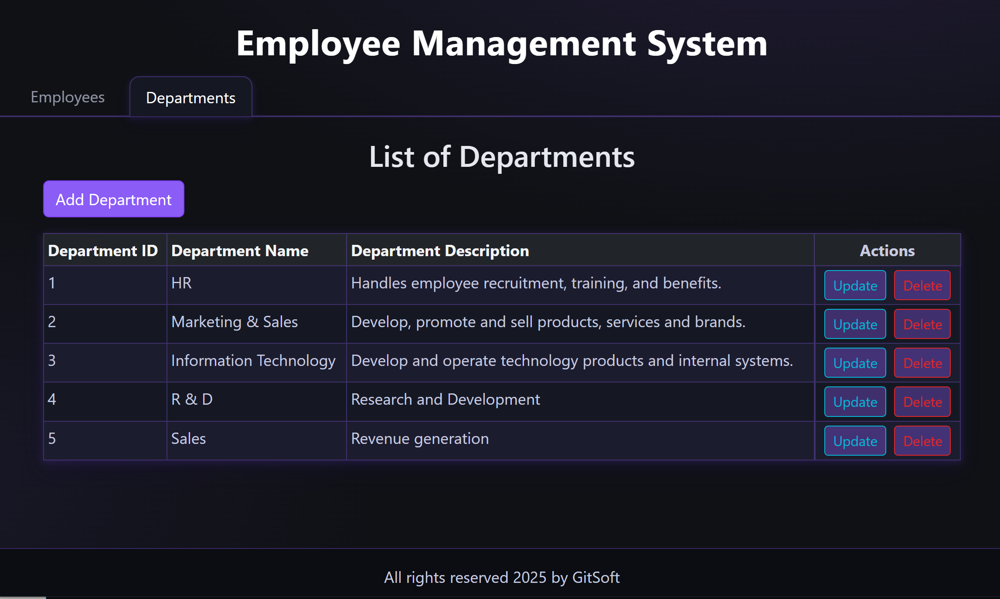
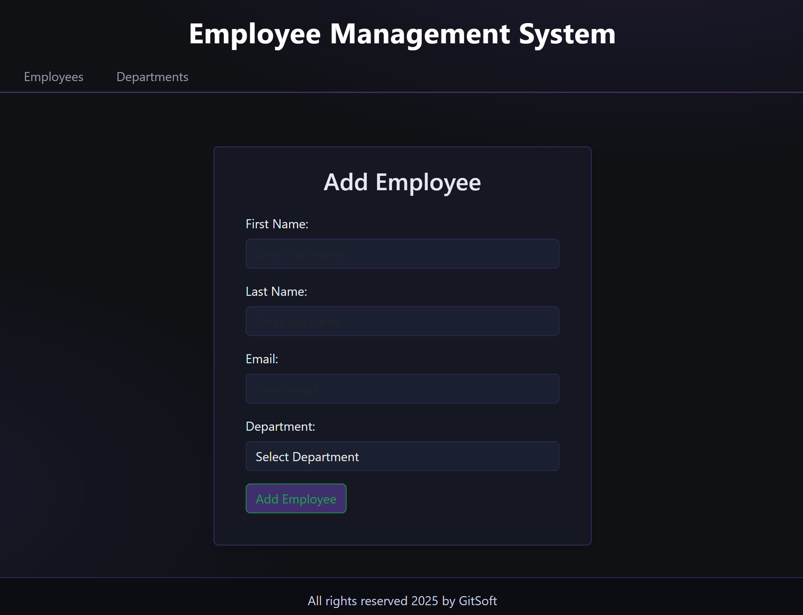
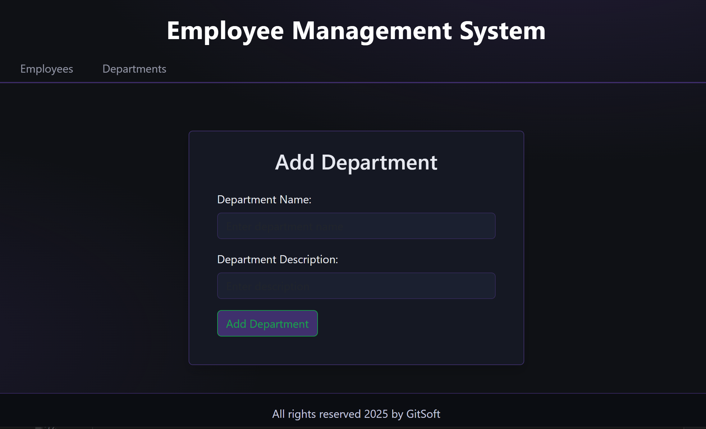
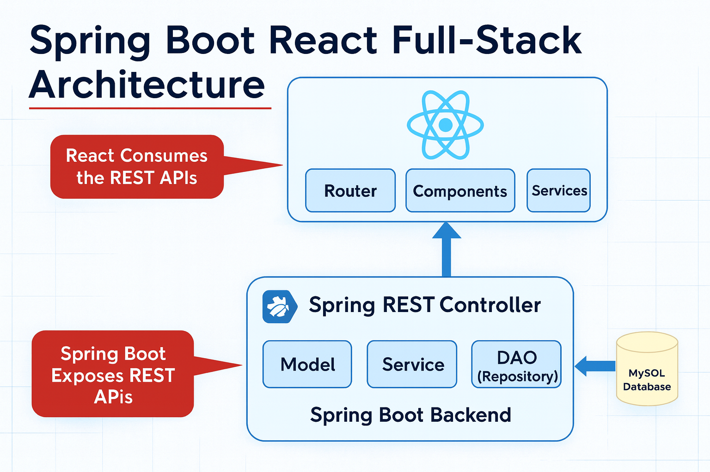

# Employee Management System (EMS)

A full-stack employee management application built with **Spring Boot 3**, **React**, **MySQL**, and **Bootstrap**, enabling seamless management of employees and departments.

This project demonstrates a modern full-stack architecture with RESTful APIs, React frontend, and Spring Boot backend, showcasing CRUD operations, relational database modeling, and responsive UI design.

---

# 📸 Screenshot Gallery (Quick Overview)

<p align="center">
  
  
</p>

<p align="center">
  
  
</p>

<p align="center">
  
</p>

---

# 🧭 Table of Contents

- [Live Demo](#live-demo)
- [Overview](#overview)
- [Features](#features)
- [Architecture](#architecture)
- [Technology Stack](#technology-stack)
- [Project Structure](#project-structure)
- [Screenshots & Feature Walkthrough](#screenshots--feature-walkthrough)
- [Database Schema](#database-schema)
- [Installation & Setup](#installation--setup)
- [API Endpoints](#api-endpoints)
- [Deployment](#deployment)
- [Future Enhancements](#future-enhancements)
- [Author](#author)

---

<a id="live-demo"></a>
# 🌐 Live Demo

**🚀 Application is live on AWS!**

**URL:** [https://ems.gitsoft.uk](https://ems.gitsoft.uk)

**Infrastructure:**
- **Hosting:** AWS EC2 (t3.micro)
- **Database:** MariaDB 10.5
- **Web Server:** Nginx with SSL/TLS
- **Domain:** Route 53 DNS
- **SSL Certificate:** Let's Encrypt (auto-renewal)

**Architecture:**
- React frontend served by Nginx (static files)
- Spring Boot REST API (port 8081, localhost only)
- Reverse proxy configuration for API requests
- Secure HTTPS with automatic HTTP redirect

---

<a id="overview"></a>
# 🧾 Overview

**Employee Management System (EMS)** is a full-featured web application where administrators can:

- Manage employee records (Create, Read, Update, Delete)
- Organize departments
- Assign employees to departments
- View comprehensive employee and department listings

Built as a portfolio project, this application demonstrates:

- RESTful API design with Spring Boot
- React frontend with React Router
- Layered architecture (Controller → Service → Repository)
- JPA/Hibernate ORM
- MySQL relational database
- Responsive UI with Bootstrap
- Axios for HTTP requests

---

<a id="features"></a>
# ⭐ Features

## 👥 Employee Management
- View all employees in a table format
- Add new employees with department assignment
- Edit existing employee information
- Delete employee records
- Search and filter employees

## 🏢 Department Management
- View all departments
- Create new departments
- Update department information
- Delete departments
- View department descriptions

## 🎨 User Interface
- Clean, responsive Bootstrap design
- Intuitive navigation with header component
- Form validation
- Real-time data updates
- Mobile-friendly layout

---

<a id="architecture"></a>
# 🏗️ Architecture

This application uses a modern **full-stack architecture** with clear separation of concerns:


**Backend Layers:**
- **Controller:** REST API endpoints
- **Service:** Business logic layer
- **Repository:** JPA data access layer
- **Entity:** Domain models

**Frontend:**
- **Components:** Reusable React components
- **Services:** API communication layer
- **Router:** Client-side routing

---

<a id="technology-stack"></a>
# 🛠️ Technology Stack

### **Backend**
- Java 21
- Spring Boot 3.5.5
- Spring Data JPA (Hibernate)
- Spring Web (REST API)
- MySQL 8
- Lombok
- Maven
- Bean Validation

### **Frontend**
- React 19.1.1
- React Router DOM 7.9.1
- Axios 1.12.2
- Bootstrap 5.3.8
- Vite 7.1.2
- JavaScript (ES6+)

### **Deployment & Infrastructure**
- AWS EC2 (t3.micro)
- AWS Route 53 (DNS)
- MariaDB 10.5
- Nginx (Reverse Proxy & SSL)
- Let's Encrypt (SSL Certificates)
- Systemd (Service Management)

### **Tools**
- IntelliJ IDEA
- VS Code
- MySQL Workbench
- Git & GitHub
- Postman (API testing)

---

<a id="project-structure"></a>
# 📁 Project Structure

```
ems/
├── backend/
│   └── src/
│       ├── main/
│       │   ├── java/uk/gitsoft/ems/
│       │   │   ├── config/
│       │   │   │   └── WebConfig.java
│       │   │   ├── controller/
│       │   │   │   ├── DepartmentController.java
│       │   │   │   └── EmployeeController.java
│       │   │   ├── dto/
│       │   │   │   ├── DepartmentDto.java
│       │   │   │   └── EmployeeDto.java
│       │   │   ├── entity/
│       │   │   │   ├── Department.java
│       │   │   │   └── Employee.java
│       │   │   ├── exception/
│       │   │   │   ├── GlobalExceptionHandler.java
│       │   │   │   └── ResourceNotFoundException.java
│       │   │   ├── mapper/
│       │   │   │   ├── DepartmentMapper.java
│       │   │   │   └── EmployeeMapper.java
│       │   │   ├── repository/
│       │   │   │   ├── DepartmentRepository.java
│       │   │   │   └── EmployeeRepository.java
│       │   │   ├── service/
│       │   │   │   ├── DepartmentService.java
│       │   │   │   ├── EmployeeService.java
│       │   │   │   └── impl/
│       │   │   └── BackendApplication.java
│       │   └── resources/
│       │       └── application.properties
│       └── test/
└── frontend/
    ├── public/
    ├── src/
    │   ├── api/
    │   ├── components/
    │   │   ├── DepartmentComponents.jsx
    │   │   ├── EmployeeComponents.jsx
    │   │   ├── HeaderComponent.jsx
    │   │   ├── ListDepartmentComponents.jsx
    │   │   └── ListEmployeeComponents.jsx
    │   ├── services/
    │   │   ├── DepartmentService.js
    │   │   └── EmployeeService.js
    │   ├── App.jsx
    │   ├── App.css
    │   ├── main.jsx
    │   └── index.css
    ├── index.html
    ├── package.json
    └── vite.config.js
```

---

<a id="screenshots--feature-walkthrough"></a>
# 📸 Screenshots & Feature Walkthrough

## 👥 Employee List

View all employees with their details including name, email, and department assignment.

---

## ➕ Add Employee

Create new employee records with department selection from dropdown.

---

## 🏢 Department List

Manage all departments with descriptions and quick action buttons.

---

## 🏢 Add Department

Create new departments with name and description.

---

## 🏗️ Spring Architecture

Backend architecture showing the layered approach.

---

<a id="database-schema"></a>
# 🧩 Database Schema

### **Entities:**

**Employee**
- `id` (Primary Key, Auto-increment)
- `first_name`
- `last_name`
- `email_id` (Unique, Not Null)
- `department_id` (Foreign Key)

**Department**
- `id` (Primary Key, Auto-increment)
- `department_name`
- `department_description`

**Relationship:**
- One Department → Many Employees (One-to-Many)
- Employee → Department (Many-to-One, EAGER fetch)

---

<a id="installation--setup"></a>
# 🧰 Installation & Setup

### 1. Clone the repository
```bash
git clone https://github.com/duchnb/ems-fullstack-app.git
cd ems
```

### 2. Create MySQL Database

```sql
CREATE DATABASE ems;
```

### 3. Configure Backend

Edit `backend/src/main/resources/application.properties`:

```properties
spring.application.name=backend
spring.datasource.url=jdbc:mysql://localhost:3306/ems
spring.datasource.username=root
spring.datasource.password=your_password

spring.jpa.properties.hibernate.dialect=org.hibernate.dialect.MySQLDialect
spring.jpa.hibernate.ddl-auto=update
```

### 4. Run Backend

```bash
cd backend
mvnw spring-boot:run
```

Backend runs on: `http://localhost:8080`

### 5. Install Frontend Dependencies

```bash
cd frontend
npm install
```

### 6. Run Frontend

```bash
npm run dev
```

Frontend runs on: `http://localhost:5173`

---

<a id="api-endpoints"></a>
# 🔌 API Endpoints

### **Employee Endpoints**

| Method | Endpoint | Description |
|--------|----------|-------------|
| GET | `/api/employees` | Get all employees |
| GET | `/api/employees/{id}` | Get employee by ID |
| POST | `/api/employees` | Create new employee |
| PUT | `/api/employees/{id}` | Update employee |
| DELETE | `/api/employees/{id}` | Delete employee |

### **Department Endpoints**

| Method | Endpoint | Description |
|--------|----------|-------------|
| GET | `/api/departments` | Get all departments |
| GET | `/api/departments/{id}` | Get department by ID |
| POST | `/api/departments` | Create new department |
| PUT | `/api/departments/{id}` | Update department |
| DELETE | `/api/departments/{id}` | Delete department |

---

<a id="deployment"></a>
# 🚀 Deployment

**This application is deployed on AWS EC2 and accessible at:** [https://ems.gitsoft.uk](https://ems.gitsoft.uk)

### **Deployment Architecture**

```
Internet → Route 53 (DNS) → EC2 Instance
                              │
                              ├─ Nginx (Port 443 - HTTPS)
                              │   ├─ React Frontend (/var/www/ems)
                              │   └─ API Proxy → Spring Boot (localhost:8081)
                              │
                              └─ MariaDB (Port 3306 - localhost only)
```

### **Key Features**
- ✅ HTTPS with Let's Encrypt SSL certificate
- ✅ Automatic HTTP to HTTPS redirect
- ✅ Nginx reverse proxy for API requests
- ✅ Systemd service for auto-restart
- ✅ Database isolation and security
- ✅ Static file caching (30-day expiry)
- ✅ Production-optimized React build

### **Deployment Guide**

For detailed deployment instructions, see:
- **[EMS Deployment Guide](deployment/EMS_DEPLOYMENT_GUIDE.md)** - Complete step-by-step tutorial
- **[Multi-App Deployment Guide](deployment/MULTI_APP_DEPLOYMENT_GUIDE.md)** - Deploying multiple apps on same server

**Topics covered:**
- AWS Route 53 DNS configuration
- MariaDB database setup
- Spring Boot production configuration
- React production build with Vite
- Nginx reverse proxy setup
- SSL certificate automation
- Systemd service management
- Troubleshooting common issues

---

<a id="future-enhancements"></a>
# 🔮 Future Enhancements

- User authentication & authorization (Spring Security)
- Role-based access control (Admin, Manager, Employee)
- Employee search and filtering
- Pagination for large datasets
- Employee profile pictures
- Department statistics dashboard
- Export data to CSV/PDF
- Email notifications
- Audit logging
- Docker containerization
- CI/CD pipeline with GitHub Actions

---

<a id="author"></a>
# 👨💻 Author

**Bogdan Duchnowski**  
Portfolio Project – Employee Management System

GitHub: [duchnb](https://github.com/duchnb)  
Repository: [ems-fullstack-app](https://github.com/duchnb/ems-fullstack-app)
